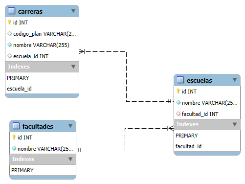

# 🎓 UASD Career Catalog - Java & Docker MVP

Este proyecto es un Producto Mínimo Viable (MVP) que automatiza el catálogo de carreras de la Universidad Autónoma de Santo Domingo (UASD). Utiliza una arquitectura de microservicios contenida en Docker para garantizar que el entorno de desarrollo sea idéntico para todos los colaboradores.

## 🚀 Características Principales

- **Infraestructura como Código:** Orquestación completa mediante `docker-compose`.
- **Base de Datos Automatizada:** MySQL 8.0 pre-configurado con scripts de inicialización (`init.sql`) que cargan facultades y carreras al primer arranque.
- **Resiliencia de Conexión:** \* **Healthchecks:** El contenedor de Java espera activamente a que MySQL esté listo para recibir conexiones antes de iniciar.
  - **Retry Logic:** Código Java implementado con bucles de reintento para manejar la latencia de red entre contenedores.
- **Gestión de Dependencias:** Maven automatizado dentro del contenedor para evitar instalaciones locales.

## 🛠️ Tecnologías Utilizadas

- **Lenguaje:** Java 17
- **Gestor de Proyectos:** Maven
- **Base de Datos:** MySQL 8.0
- **Contenerización:** Docker & Docker Compose
- **Driver JDBC:** MySQL Connector/J

## 📋 Requisitos Previos

Solo necesitas tener instalado:

- [Docker Desktop](https://www.docker.com/products/docker-desktop/)
- Git

_Nota: No necesitas instalar Java, Maven o MySQL en tu máquina local._

## ⚙️ Instrucciones de Instalación y Uso

1.  **Clonar el repositorio:**

    ```bash
    git clone [https://github.com/CedanoDev/uasd-career-catalog.git](https://github.com/CedanoDev/uasd-career-catalog.git)
    cd uasd-career-catalog
    ```

2.  **Levantar el entorno:**
    Ejecuta el siguiente comando en la terminal:

    ```bash
    docker-compose up --build
    ```

3.  **Verificación:**
    Una vez que MySQL esté "Healthy", el contenedor de Java se ejecutará automáticamente y verás en la consola el listado de las carreras de la Escuela de Informática extraídas directamente de la base de datos.

## 📂 Estructura del Proyecto

```text
uasd-career-catalog/
├── db/
│   └── init.sql          # Scripts de creación de tablas y datos
├── java-app/
│   ├── src/              # Código fuente Java
│   ├── Dockerfile        # Definición de la imagen de Java/Maven
│   └── pom.xml           # Dependencias del proyecto
├── docker-compose.yml    # Orquestación de servicios y salud del sistema
└── .gitignore            # Exclusión de archivos temporales y target
```

✒️ Autores
Edward Cedano Ogando - 100630954

## 📊 Modelo Relacional


